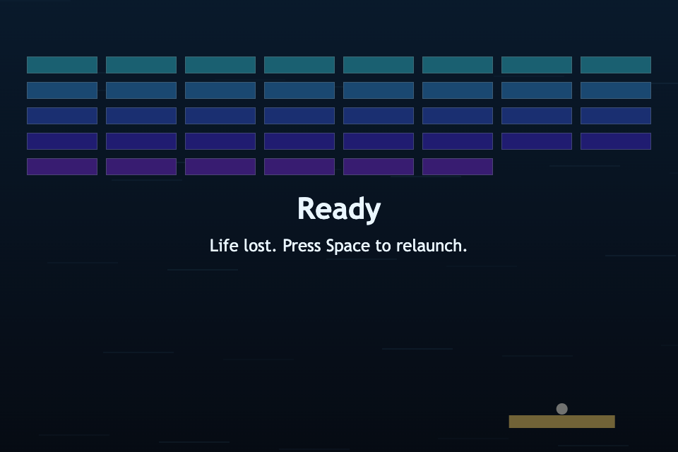

# daily-classic-game-2026-02-27-arkanoid-multi-ball-bonus

  <h3>Pattern-breaker Arkanoid run with deterministic physics and a multi-ball combo twist.</h3>

  

## GIF Captures
- Clip 1 - Opening Board: `assets/gifs/clip-1-opening.gif`
- Clip 2 - Multi-ball Chain: `assets/gifs/clip-2-multiball.gif`
- Clip 3 - End State and Reset: `assets/gifs/clip-3-reset.gif`

## Quick Start
- `pnpm install`
- `pnpm dev`
- `pnpm test`
- `pnpm build`

## How To Play
- Launch with `Space` (or Launch button).
- Move paddle with `Left/Right` arrows.
- Keep at least one ball alive while clearing all bricks.
- Use `P` to pause/resume and `R` to reset instantly.

## Rules
- One life is lost when every active ball falls below the board.
- Clearing bricks in a chain builds combo.
- At combo threshold, twist activates: a bonus ball spawns.
- Clear every brick to win the run.

## Scoring
- Base brick break score is 10.
- Combo multiplier increases each consecutive brick hit chain.
- Multi-ball increases scoring opportunities by keeping two balls active.

## Twist
- Twist used: **multi-ball bonus**.
- After combo buildup, the game spawns a second ball with deterministic seeded variance.
- Deterministic verification is recorded in `playwright/main-actions/solver-summary.json` (`multiBallTriggered=true`).

## Verification
- `pnpm test`
- `pnpm build`
- `node scripts/self_check.mjs`
- Playwright capture via `web_game_playwright_client` with `playwright/actions/main-actions.json`

## Project Layout
- `src/` core game logic and rendering loop
- `test/` node test coverage for deterministic engine behavior
- `playwright/actions/` scripted action payloads for automation playback
- `playwright/main-actions/` screenshots and JSON snapshots
- `docs/plans/` implementation planning artifacts
- `assets/` hero + capture media for repo presentation
